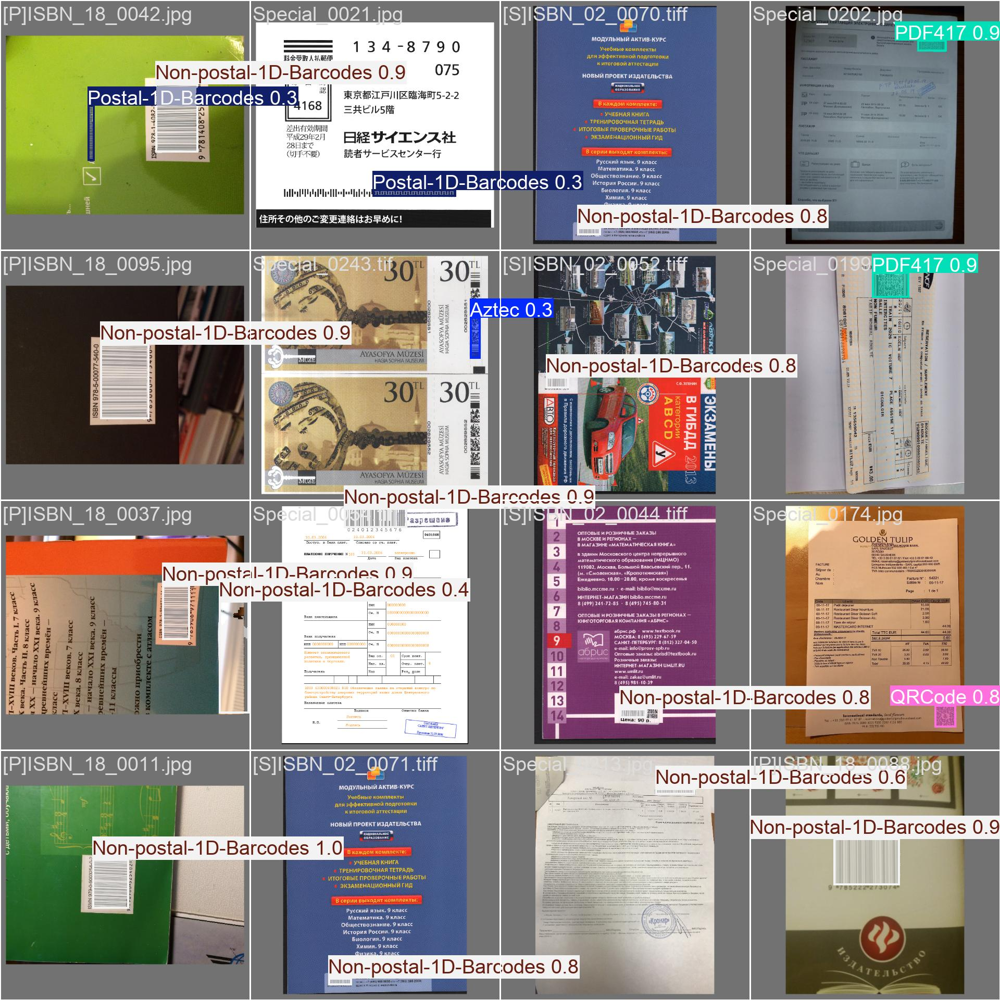

# YOLOv11 Barcode Detection

## Project Description
This repository contains the code and results for training a YOLOv11 model for barcode detection using the [ZVZ Barcode Detection Benchmark dataset](https://github.com/abbyy/barcode_detection_benchmark). Only the subset of real images from the dataset was used for training and testing.

## Tools Used
The model training was performed using the Ultralytics platform. The dataset was prepared and adjusted to meet YOLO's training requirements.

## Data Preparation
To reproduce the training, the data should be organized as follows:

1. Move images from the dataset's `real[infer]` folder to `dataset/images/infer`.
2. Move images from `real[train]` to `dataset/images/train`.
3. Move images from `real[valid]` to `dataset/images/valid`.

## Testing Results
The testing was conducted on the test subset of real images, using the YOLOv11 Nano model fine-tuned for barcode detection. Below are the performance metrics across all barcodes and each specific barcode type:

| Class                | Images | Instances | Box(P) | Box(R) | Box(mAP50) | Box(mAP50-95) | Mask(P) | Mask(R) | Mask(mAP50) | Mask(mAP50-95) |
|----------------------|--------|-----------|--------|--------|------------|---------------|---------|---------|-------------|----------------|
| all                  | 306    | 412       | 0.915  | 0.887  | 0.94       | 0.765         | 0.916   | 0.885   | 0.943       | 0.751          |
| Aztec                | 19     | 20        | 0.859  | 0.917  | 0.94       | 0.801         | 0.859   | 0.913   | 0.94        | 0.781          |
| DataMatrix           | 20     | 21        | 0.944  | 0.804  | 0.924      | 0.813         | 0.944   | 0.8     | 0.924       | 0.666          |
| Non-postal-1D-Barcodes | 130 | 171       | 0.944  | 0.918  | 0.973      | 0.809         | 0.946   | 0.918   | 0.973       | 0.803          |
| PDF417               | 61     | 74        | 0.986  | 0.956  | 0.983      | 0.845         | 0.986   | 0.955   | 0.984       | 0.83           |
| Postal-1D-Barcodes   | 76     | 78        | 0.868  | 0.897  | 0.914      | 0.544         | 0.872   | 0.897   | 0.926       | 0.656          |
| QRCode               | 43     | 48        | 0.888  | 0.827  | 0.909      | 0.781         | 0.888   | 0.826   | 0.909       | 0.772          |

## Sample Detection Result
Below is an example of the model's barcode detection result:

